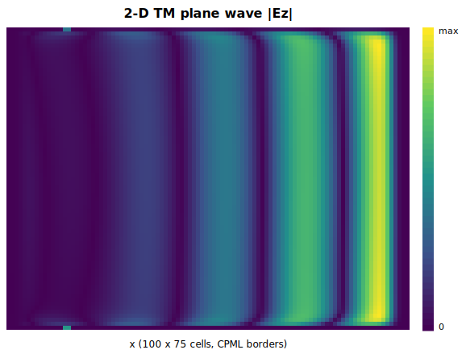

# MagnetoPhotonic.jl

A Julia package for **magneto-photonic time-domain electromagnetics**: a general,
MEEP-like **1-D / 2-D / 3-D FDTD** engine coupled to a tunable **magneto-optic**
material model (three-/four-temperature electron–lattice–spin dynamics + Landau–Lifshitz–Bloch
magnetization + Kerr/Faraday gyrotropy) for simulating **all-optical magnetization switching**
in integrated photonic devices.


> `MagnetoPhotonic` is an umbrella package for magneto-photonic solvers. It ships an
> **FDTD** solver today; a **Discontinuous Galerkin Time-Domain (DGTD)** solver is planned.

---

## Features

- **General EM-FDTD** in 1-D, 2-D (TM/TE) and 3-D on a non-uniform Yee grid, with a clean
  `Simulation(...)` API (cell, resolution, geometry, sources, boundary).
- **CFS-CPML** absorbing boundaries (ψ-convolution) in every dimension, plus `PEC` and `Periodic`.
- **Materials by refractive index** and **Drude–Lorentz ADE dispersion** in all dimensions.
- **Sources**: Gaussian-pulse / continuous, point and plane-wave (transverse current sheet).
- **Monitors**: point probes, field-slice capture, signed plane-integrated **Poynting flux**, DFT.
- **Magneto-optic stack**: tunable two-sublattice GdFeCo model — 4-temperature thermal bath +
  LLB magnetization + magneto-optic gyration — driving **deterministic all-optical switching**.
- **Geometry**: boxes, polygons, (tapered) waveguides, cylinders, letter shapes; a `Scene`
  builder; OBJ/SVG device export.
- **88 passing tests** on Julia 1.12 (CPU). CUDA / HDF5 / Makie are optional extensions.

## Installation

The package targets **Julia ≥ 1.12**. From the repository root:

```julia
julia --project=. -e 'using Pkg; Pkg.instantiate()'
julia --project=. -e 'using Pkg; Pkg.test()'
```

To use it from your own scripts, `Pkg.develop` the local path (or `Pkg.add` the Git URL once published):

```julia
using Pkg; Pkg.develop(path="path/to/MagnetoPhotonic.jl")
using MagnetoPhotonic
```

---

## Quick start: general EM-FDTD

A `Simulation` is built from a cell size, a resolution (`dx`), some `sources`, and a
`boundary`. `run!` advances it and records any `monitors`.

### 1-D — Gaussian pulse into a CPML boundary

```julia
using MagnetoPhotonic
p = FDTDParams()
pulse = GaussianPulse(; amplitude=1.0, tau=4e-15, t0=16e-15, omega=2pi*p.c0/800e-9)

sim = Simulation(; cell=(4e-6,), dx=10e-9, dimension=1,
                 sources=[PointSource(pulse, :Ez, 2e-6)], boundary=PML(20), courant=0.5)
mon = PointMonitor(:Ez, 3e-6)
run!(sim; until=120e-15, monitors=[mon])
```

```text
steps=14390   peak |Ez| @ probe = 1.942   energy final/peak = 3.58e-22
```

The pulse propagates at `c`, passes the probe, and is absorbed by the CPML — the residual
domain energy drops to ~`1e-22` of its peak.

### 2-D — TM plane wave with CPML

A `PlaneSource` is a transverse current sheet (a line in 2-D), launching a plane wave:

```julia
pw = GaussianPulse(; amplitude=1.0, tau=10e-15, t0=40e-15, omega=2pi*p.c0/800e-9)
sim = Simulation(; cell=(2e-6, 1.5e-6), dx=20e-9, dimension=2, mode=:TM,
                 sources=[PlaneSource(pw, :Ez; axis=:x, position=0.3e-6)],
                 boundary=PML(10), courant=0.4)
frames = FieldMonitor(:Ez; every=25)
run!(sim; until=80e-15, monitors=[frames])
```

```text
grid = (100, 75)   dt = 9.43 as   frames captured = 339   final energy = 9.15e-32
```



Use `mode=:TM` for `(Ez, Hx, Hy)` or `mode=:TE` for `(Hz, Ex, Ey)`.

### 3-D — point source, CPML absorption

```julia
sp = GaussianPulse(; amplitude=1.0, tau=2e-15, t0=8e-15, omega=2pi*p.c0/800e-9)
sim = Simulation(; cell=(1e-6, 1e-6, 1e-6), dx=40e-9, dimension=3,
                 sources=[PointSource(sp, :Ez, (0.5e-6, 0.5e-6, 0.5e-6))],
                 boundary=PML(8), courant=0.35)
run!(sim, 4000)
```

```text
grid = (25, 25, 25)   energy final/peak = 8.9e-10   # 3-D CPML absorbs to ~1e-9
```

---

## Materials and geometry

Add shapes (with a material) to a `Scene`. Materials can be given by refractive index, or
by Drude–Lorentz `poles` for dispersion:

```julia
scene = Scene()
add_shape!(scene, Box(1e-6, 2e-6, -1, 1, -1, 1), Material("n=2 slab"; index=2.0))
sim = Simulation(; cell=(3e-6,), dx=5e-9, dimension=1, geometry=scene,
                 sources=[PointSource(pulse, :Ez, 0.4e-6)], boundary=PML(20))
```

Shape primitives: `Box`, `PolygonShape`, `Waveguide`, `TaperedWaveguide`, `Cylinder`,
`Letter`. A small device library is included (`not_gate_60um`, `passive_waveguide`,
`hm_test_pattern`), with OBJ/SVG export via `write_device_obj` / `write_plan_svg`.


## Monitors

| Monitor | Records |
|---|---|
| `PointMonitor(component, pos)` | interpolated field time-trace at a physical point |
| `FieldMonitor(component; every=n)` | field slices for animation |
| `FluxMonitor(axis, pos)` | signed, plane-integrated Poynting flux through a normal plane |
| `DFTMonitor(component, pos)` | trace + on-demand `compute_spectrum` |

---

## Validation

**Second-order accuracy.** Propagating a smooth Gaussian field (no source) and comparing to
the exact translate gives the expected O(Δx²) Yee convergence:

```text
dx (nm) = [40, 20, 10]
L2 err  = [0.0141, 0.00353, 0.000883]
orders  = (2.00, 2.00)
```


**Dispersion.** A Drude–Lorentz slab driven at 800 nm reproduces the correct transmitted
spectral peak:

```julia
cv = convergence_study(; dimension=2, mode=:TM, dispersive=true, pml=true,
                       dxs=(50e-9, 35e-9), L=1e-6, T_max=90e-15)
cv.spectrum.freq[argmax(cv.spectrum.amplitude)] / 1e12   # → 377.8  (THz; 800 nm ≈ 375 THz)
```

The `studies/` folder reproduces the lab's `Convergence_study` (free-space / PML / dielectric /
dispersive, in 1-D, 2-D and 3-D):

```text
julia --project=. studies/conv_wave_in_a_box.jl
julia --project=. studies/conv_wave_with_pml.jl
julia --project=. studies/conv_3d.jl
```

---

## Magneto-optic all-optical switching

The headline application: an ultrafast laser pulse deposits heat in a GdFeCo film, and the
coupled **4-temperature + LLB** dynamics deterministically reverse both magnetic sublattices.
The model is fully tunable — every GdFeCo parameter is a keyword on `MagnetoOpticModel`.

```julia
using MagnetoPhotonic
config = SimConfig(
    grid   = GridConfig(xlim=(0.0,1.5e-6), ylim=(-0.4e-6,0.4e-6), zlim=(-0.4e-6,0.4e-6),
                        dx=0.1e-6, courant=0.3),
    source = SourceConfig(component=:Ez, amplitude=1e2, tau=15e-15, t0=45e-15),
    device = DeviceConfig(wg_width=0.3e-6, wg_height=0.3e-6, film_thickness=0.2e-6),
    model  = ModelConfig(multiphysics_subcycle=4),
    steps  = 150, precision = Float64,
)
model = MagnetoOpticModel()           # or e.g. MagnetoOpticModel(; T_Curie=560.0, Q_voigt_TM=0.025)
res = run_pump_probe_sim(config; model=model, thermal_kick=1150.0, relax_steps=8000)
```

```text
material cells     = 32
mean m_TM_x (FeCo) :  1.000  ->  -0.990     # FeCo reversed
mean m_RE_x (Gd)   : -0.998  ->   0.968     # Gd reversed
switched fraction  = 1.0                    # complete, deterministic switch
```


A fully-coupled FDTD path (Yee + CPML + ADE + magneto-optic gyration + 4TM + LLB) is also
available directly through `FDTDState` / `step!` / `relax_step!` for custom geometries.

---

## Package layout

```
src/
  core/        constants, config structs, materials, backend
  geometry/    Vec2, shapes, rasterizers (1D/2D/3D), Scene, device library
  grid/        Axis1D, Grid1D/2D/3D, uniform/graded/propagation axes, CFL
  fdtd/        Fields, Maxwell (1D/2D/3D Yee), CPML, Boundary, Source, Dispersion, MagnetoOptic, Solver
  physics/     Models (GdFeCo), Thermal (4TM), Magnetization (LLB), Coupling, Polarimetry
  sim/         Simulation, Run, Monitors            # the general MEEP-like layer
  viz/         device views, field video, diagnostics
  drivers/     run_pump_probe_sim, convergence_study
ext/           CUDA / HDF5 / Makie / KernelAbstractions extensions (optional)
studies/       convergence-study replications
examples/      runnable 1D/2D/3D + device + pump-probe scripts
docs/          Documenter site (see below)
```

## Documentation

The full documentation (build with [Documenter.jl](https://documenter.juliadocs.org/)) lives in `docs/`:

```julia
julia --project=docs -e 'using Pkg; Pkg.develop(path="."); Pkg.instantiate()'
julia --project=docs docs/make.jl          # output in docs/build/index.html
```

Pages: *Getting Started*, *EM-FDTD Tutorial*, *Magneto-Optic Switching*, *API Reference*.

## Status and roadmap

- **Compute is CPU** and is what the test suite validates. CUDA / HDF5 / CairoMakie are
  optional weak-dependency extensions (device arrays, HDF5 I/O, plotting/video).
- **Planned**: a DGTD solver under the same umbrella; porting the FDTD kernels to
  KernelAbstractions for GPU execution; full quantitative validation against the lab's
  production CUDA reference at device scale.

## License

[MIT](LICENSE) © 2026 Muhammad Arief Mulyana.
