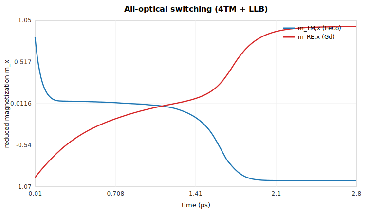

# MagnetoPhotonic.jl

A Julia package for **magneto-photonic time-domain electromagnetics**: a general,
Meep-like **1-D / 2-D / 3-D FDTD** engine *coupled* to a tunable, **dynamical magneto-optic**
material model — four-temperature electron–lattice–spin dynamics + two-sublattice
Landau–Lifshitz–Bloch magnetization + magnetization-dependent (Kerr/Faraday) gyrotropy — for
simulating **all-optical magnetization switching** in integrated photonic devices.


> `MagnetoPhotonic` is an umbrella package for magneto-photonic solvers. It ships an
> **FDTD** solver today; a **Discontinuous Galerkin Time-Domain (DGTD)** solver is planned.

📖 **Full documentation:** <https://physarief78.github.io/MagnetoPhotonic.jl> &nbsp;·&nbsp;
*Introduction → Fundamentals → Getting Started → Tutorials → Capabilities → API.*

---

## Philosophy & origin

This package grew out of an undergraduate physics thesis at **Universitas Padjadjaran (UNPAD)** —
*“a first-principles feasibility assessment of a compact all-photon NOT gate that writes a bit
through thermally-driven helicity-independent all-optical switching (AO-HIS) in a GdFeCo film and
reads it through a guided magneto-optical probe, on a fabrication-light silicon-nitride
(Si₃N₄) platform.”*

That study could not be done with an off-the-shelf electromagnetic solver. Established FDTD
packages (Meep, commercial tools) treat magneto-optics as a **static** input — you fix a
magnetization or bias field and they compute the Faraday/Kerr response of that frozen state.
All-optical switching is the opposite problem: the magnetization is a **dynamical unknown** that
*reverses* because the guided pulse heats the film through its Curie point. Capturing that needs
the electromagnetic field, the absorbed-power → temperature path, and the magnetization to evolve
**self-consistently, in one time loop**.

So the thesis built that loop *from scratch in Julia*, on a consumer GPU, “to ensure full
transparency and control over all numerical assumptions.” **MagnetoPhotonic.jl is that solver,
generalized** — refactored from a single-purpose research script into a modular, tested,
backend-portable library, while reproducing the thesis’s production results to ~0.1 %.

The design principles inherited from the thesis:

1. **Transparency over black-box.** Every kernel — Yee leap-frog, CFS-CPML, Drude–Lorentz ADE,
   4-temperature bath, LLB, gyrotropic coupling — is readable Julia you can audit and modify.
2. **Coupled multiphysics as a first-class citizen,** not a post-processing add-on.
3. **Runs on accessible hardware.** The reference results were produced on a 6 GB consumer
   GeForce RTX 3050; the GPU path is tuned to fit and run there.
4. **Internally validated.** A Cauchy grid-refinement convergence study, a CPU test suite, and a
   bit-level comparison against the production CUDA reference.

## Relationship to Meep

The **electromagnetic core is deliberately Meep-like**, so if you have used [Meep](https://meep.readthedocs.io/)
the mental model carries over: a Yee-grid FDTD `Simulation` you build from a cell, a resolution,
geometry, sources and a boundary, then `run!`; PML/CPML absorbers; dispersive media; sources; and
flux/DFT monitors.

**What is the same**

| Capability | Meep | MagnetoPhotonic.jl |
|---|---|---|
| Yee-grid FDTD, 1-D/2-D/3-D | ✅ | ✅ (non-uniform grid) |
| PML / CPML absorbing boundaries | ✅ | ✅ (CFS-CPML, ψ-convolution) |
| Dispersive materials | ✅ (Lorentz/Drude) | ✅ (Drude–Lorentz ADE) |
| Sources, flux & DFT monitors | ✅ | ✅ |
| Subpixel permittivity averaging | ✅ | ✅ |

**What is different — the reason this package exists**

| | Meep | MagnetoPhotonic.jl |
|---|---|---|
| Magnetization | **static** input (fixed bias / saturated gyrotropy) | **dynamical** field, evolved by 4TM + LLB |
| Thermal model | none | 4-temperature (electron / lattice / TM-spin / RE-spin) |
| All-optical switching | not modelable | **the headline use case** |
| Read-out | manual | built-in pump–probe + polarimetric T/R/A, Faraday/Kerr |
| Language / stack | C++ core, Python/Scheme front-end | pure **Julia** |
| GPU | MPI/CPU clusters | **GPU-native** (KernelAbstractions + native CUDA fast path) |

**Advantages.** It models the *write* step, not just the *read* (the gyrotropic permittivity is
recomputed every step from the *current* magnetization, which the pump can reverse); it is a
single inspectable Julia stack; it is GPU-native on a laptop-class card; and it is reproducible
and validated end-to-end against a CUDA production reference.

**Where Meep is still ahead — honestly.** Meep is far more mature, with adjoint/inverse design,
eigenmode decomposition, near-to-far transforms, cylindrical coordinates, large-scale MPI, and a
big material library and community. MagnetoPhotonic.jl is a young (v0.1), focused, single-node
solver specialized for **coupled magneto-optic switching**. Use Meep for general nanophotonics;
use this when the magnetization must *evolve*.

---

## Get started

The package targets **Julia ≥ 1.12**. It is **not yet in the General registry**, so install it
straight from the GitHub repository:

```julia
using Pkg
Pkg.add(url="https://github.com/physarief78/MagnetoPhotonic.jl")
```

or, equivalently, from the Pkg REPL (press `]`):

```
pkg> add https://github.com/physarief78/MagnetoPhotonic.jl
```

Then load it:

```julia
using MagnetoPhotonic
```

The CPU path needs nothing else. GPU, HDF5 I/O, and plotting are **optional extensions** — add the
package you want and the corresponding extension loads automatically:

```julia
Pkg.add("CUDA")        # CUDA GPU backend
Pkg.add("HDF5")        # HDF5 schema I/O
Pkg.add("CairoMakie")  # figures / field video
```

A minimal run — a Gaussian pulse launched into a 1-D domain and absorbed by a CPML boundary:

```julia
using MagnetoPhotonic
p = FDTDParams()
pulse = GaussianPulse(; amplitude=1.0, tau=4e-15, t0=16e-15, omega=2pi*p.c0/800e-9)

sim = Simulation(; cell=(4e-6,), dx=10e-9, dimension=1,
                 sources=[PointSource(pulse, :Ez, 2e-6)], boundary=PML(20))
mon = PointMonitor(:Ez, 3e-6)
run!(sim; until=120e-15, monitors=[mon])      # peak |Ez| @ probe ≈ 1.942
```

> **Working on the package itself?** Clone it and use its own project to run the test suite:
> ```
> git clone https://github.com/physarief78/MagnetoPhotonic.jl
> julia --project=MagnetoPhotonic.jl -e 'using Pkg; Pkg.instantiate(); Pkg.test()'
> ```

### What you can compute (at a glance)

| Area | Capability |
|---|---|
| **Dimensions** | 1-D, 2-D (`:TM` / `:TE`), 3-D on a non-uniform Yee grid |
| **Boundaries** | `PML` / CFS-CPML (ψ-convolution), `PEC`, `Periodic` |
| **Materials** | by refractive index, or Drude–Lorentz **ADE** dispersion (all dimensions) |
| **Sources** | Gaussian-pulse / continuous; point, plane-wave, guided **mode** |
| **Monitors** | point probe, field-slice, signed **Poynting flux**, **DFT**, polarimetric **pump–probe** (T/R/A, Faraday/Kerr) |
| **Magneto-optics** | tunable two-sublattice GdFeCo: 4-temperature bath + **LLB** + dynamical gyrotropy → **all-optical switching** |
| **Geometry** | boxes, polygons, (tapered) waveguides, cylinders, letters; `Scene` builder; OBJ/SVG export; a device library |
| **Backends** | CPU and CUDA via KernelAbstractions, with a native `@cuda` Maxwell fast path |
| **I/O & viz** | HDF5 schema I/O, field video, device views (optional extensions) |

> For everything beyond the snippet above — the physics, step-by-step tutorials, the full
> capability matrix, and the API — read the **[documentation](https://physarief78.github.io/MagnetoPhotonic.jl)**.

---

## The marquee: all-optical magnetization switching

An ultrafast laser pulse deposits heat in a GdFeCo film, and the coupled **4-temperature + LLB**
dynamics deterministically reverse both magnetic sublattices. Because the FeCo (TM) and Gd (RE)
spin baths demagnetize on different timescales (≈100 fs vs ≈430 fs), **FeCo reverses first
(~0.9 ps) and Gd follows (~1.5 ps)**, opening a transient-ferromagnetic window.



```text
mean m_TM_x (FeCo) :  1.000  ->  -0.990     # FeCo reversed
mean m_RE_x (Gd)   : -0.998  ->   0.968     # Gd reversed
switched fraction  = 1.0                    # complete, deterministic switch
```

The full pump → relax → probe pipeline (Yee + CPML + ADE + magneto-optic gyration + 4TM + LLB)
reproduces the production CUDA reference to ~0.1 % (switch fraction 0.7823 vs 0.7831, Faraday
contrast 1.684° vs 1.690°). See the **[Magneto-Optic Switching tutorial](https://physarief78.github.io/MagnetoPhotonic.jl)**
for how to drive it.

---

## Documentation

The full site (built with [Documenter.jl](https://documenter.juliadocs.org/)) is published at
**<https://physarief78.github.io/MagnetoPhotonic.jl>** and organized as:

| Section | Contents |
|---|---|
| **Introduction** | motivation, thesis origin, where it sits next to Meep |
| **Fundamentals** | the physics & numerics: Yee FDTD, CPML, ADE dispersion, 4TM, LLB, gyrotropy, units & precision |
| **Getting Started** | install, the `Simulation` anatomy, your first run |
| **Tutorials** | worked EM-FDTD (1-D/2-D/3-D) and magneto-optic switching examples |
| **Capabilities** | the full capability matrix, backends/GPU, performance, validation |
| **API Reference** | the complete public surface |

Build it locally:

```julia
julia --project=docs -e 'using Pkg; Pkg.develop(path="."); Pkg.instantiate()'
julia --project=docs docs/make.jl          # output in docs/build/index.html
```

On push to `main`, the `Documentation` GitHub Action builds and deploys the site to GitHub Pages.

---

## Package layout

```
src/
  core/        constants, config structs, materials, backend, precision
  geometry/    Vec2, shapes, rasterizers (1D/2D/3D), Scene, device + reference geometry
  grid/        Axis1D, Grid1D/2D/3D, uniform/graded/propagation axes, CFL
  fdtd/        Fields, Maxwell (1D/2D/3D Yee), CPML, Boundary, Source, ModeSolver,
               Dispersion, MagnetoOptic, Kernels (KernelAbstractions), Solver
  physics/     Models (GdFeCo), Thermal (4TM), Magnetization (LLB), Coupling, Polarimetry
  sim/         Simulation, Run, Monitors, ProbeReadout, Experiment   # the Meep-like layer
  viz/         device views, field video, diagnostics
  io/          HDF5 schema I/O
  drivers/     run_pump_probe_sim, convergence_study, presets
ext/           CUDA / HDF5 / CairoMakie extensions (optional weak deps)
examples/      runnable 1D/2D/3D + device + pump-probe + perf-test scripts
docs/          Documenter site
test/          CPU test suite
```

## Status and roadmap

- **GPU is implemented and validated.** All kernels run on CPU or CUDA via KernelAbstractions;
  the two Maxwell kernels have a native `@cuda` fast path. The full pump → relax → probe pipeline
  reproduces the production CUDA reference to ~0.1 %.
- **AMD / other GPUs**: the kernels are backend-agnostic; adding an `AMDGPUBackend` is a small
  extension (a backend struct + a ~40-line AMDGPU extension mirroring the CUDA one).
- **CPU is the test-suite baseline.** CUDA / HDF5 / CairoMakie are optional weak-dependency
  extensions (device arrays, HDF5 I/O, plotting/video).
- **Planned**: a DGTD solver under the same umbrella; per-section mixed precision; broader
  device/material libraries.

## Citing

If you use MagnetoPhotonic.jl in academic work, please cite the thesis it originates from:

```bibtex
@thesis{Mulyana2026MagnetoPhotonic,
  author = {Muhammad Arief Mulyana},
  title  = {Feasibility of a Magneto-Optical All-Photon NOT Gate via
            Helicity-Independent All-Optical Switching: A First-Principles
            Multiphysics FDTD Study},
  school = {Universitas Padjadjaran},
  year   = {2026}
}
```

## License

Licensed under the [GNU General Public License v3.0 only](LICENSE)
(`GPL-3.0-only`). Copyright © 2026 Muhammad Arief Mulyana.
