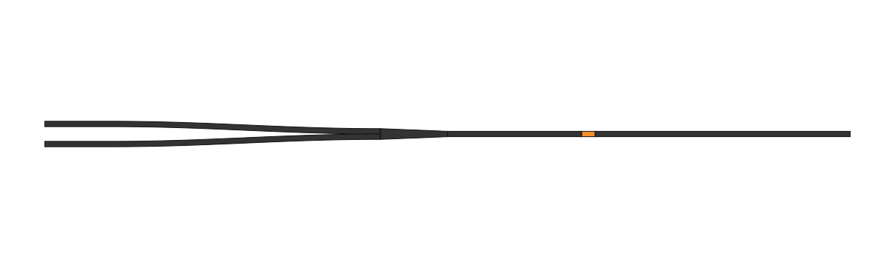
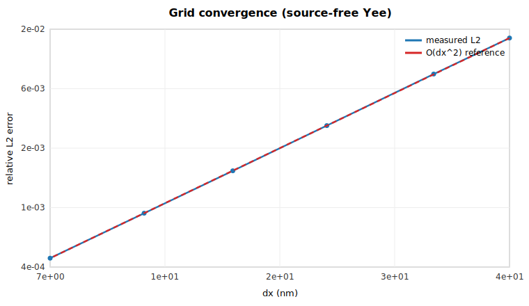

# EM-FDTD Tutorial

The general electromagnetic FDTD layer works identically in 1-D, 2-D and 3-D through the
same `Simulation` / `run!` API. All outputs below are produced on CPU with
Julia 1.12.

## 1-D: pulse propagation and CPML absorption

```julia
using MagnetoPhotonic
p = FDTDParams()
pulse = GaussianPulse(; amplitude=1.0, tau=4e-15, t0=16e-15, omega=2pi*p.c0/800e-9)

sim = Simulation(; cell=(4e-6,), dx=10e-9, dimension=1,
                 sources=[PointSource(pulse, :Ez, 2e-6)], boundary=PML(20), courant=0.5)
mon = PointMonitor(:Ez, 3e-6)
run!(sim; until=120e-15, monitors=[mon])
```

```text
steps=14390   peak |Ez| @ probe = 1.942   energy final/peak = 3.58e-22
```

`PML(20)` is a 20-cell CFS-CPML layer. After the pulse exits, the residual domain energy is
~`1e-22` of the peak — the boundary is genuinely absorbing (with `PEC()` the energy would be
retained and bounce indefinitely).

## 2-D: TM/TE modes and sources

`mode=:TM` evolves `(Ez, Hx, Hy)`; `mode=:TE` evolves `(Hz, Ex, Ey)`. Two source types
cover most experiments: a `PointSource` (a single driven cell) and a `PlaneSource`
(a transverse current sheet — a line in 2-D — launching a plane wave normal to `axis`).

### A point source radiating from the center

A `GaussianPulse` is a sine wave modulated by a Gaussian envelope. Driving one central
cell with it sends out an expanding train of cylindrical wavefronts — a "ripple in a
pond" — cleanly absorbed by the CPML on every side
(`examples/point_source_2d.jl`):

```julia
pw  = GaussianPulse(; amplitude=1.0, tau=20e-15, t0=30e-15, omega=2pi*p.c0/700e-9)
sim = Simulation(; cell=((0.0,4e-6),(0.0,4e-6)), dx=20e-9, dimension=2, mode=:TM,
                 sources=[PointSource(pw, :Ez, (2e-6, 2e-6))],   # source in the MIDDLE
                 boundary=PML(10), courant=0.45)
frames = FieldMonitor(:Ez; every=25)
run!(sim, 1300; monitors=[frames])
```


### A plane wave diffracting through a single slit

Place an opaque wall across the middle of the domain with a sub-wavelength slit, and a
plane wave passing through it spreads into Huygens semicircular wavefronts — the textbook
diffraction demonstration. The wall is made perfectly reflecting (PEC) by forcing `Ez = 0`
in the barrier cells every step via the `run!` callback (`examples/slit_diffraction_2d.jl`):

```julia
pw  = GaussianPulse(; amplitude=1.0, tau=8e-15, t0=24e-15, omega=2pi*p.c0/700e-9)
sim = Simulation(; cell=((0.0,4e-6),(0.0,3e-6)), dx=20e-9, dimension=2, mode=:TM,
                 sources=[PlaneSource(pw, :Ez; axis=:x, position=0.5e-6)],
                 boundary=PML(10), courant=0.45)

# opaque wall at x≈2 µm with a 0.4 µm slit at the center (Ez forced to 0 each step)
xs, ys = sim.grid.x.centers, sim.grid.y.centers
mask = [1.95e-6 <= x <= 2.05e-6 && !(1.30e-6 <= y <= 1.70e-6) for x in xs, y in ys]
run!(sim, 2200; callback = s -> (s.fields.Ez[mask] .= 0.0))
```


- A `FieldMonitor` stores field slices every `every` steps, e.g. for an animation. With the
  optional `CairoMakie` extension, `render_field_video(frames.frames, "out.mp4")` writes a video.

## 3-D: full Yee with CPML

```julia
sp = GaussianPulse(; amplitude=1.0, tau=2e-15, t0=8e-15, omega=2pi*p.c0/800e-9)
sim = Simulation(; cell=(1e-6, 1e-6, 1e-6), dx=40e-9, dimension=3,
                 sources=[PointSource(sp, :Ez, (0.5e-6, 0.5e-6, 0.5e-6))],
                 boundary=PML(8), courant=0.35)
run!(sim, 4000)
```

```text
grid = (25, 25, 25)   energy final/peak = 8.9e-10
```

## Materials and geometry

Build a `Scene` of shapes, each paired with a `Material`. Materials accept a
refractive `index`, an explicit `epsr`, or Drude–Lorentz `poles` for dispersion.

```julia
scene = Scene()
add_shape!(scene, Box(1e-6, 2e-6, -1, 1, -1, 1), Material("n=2 slab"; index=2.0))

sim = Simulation(; cell=(3e-6,), dx=5e-9, dimension=1, geometry=scene,
                 sources=[PointSource(pulse, :Ez, 0.4e-6)], boundary=PML(20))
```

Shape primitives: `Box`, `PolygonShape`, `Waveguide`, `TaperedWaveguide`, `Cylinder`,
`Letter`. A device library is included — `not_gate_60um`, `passive_waveguide`,
`hm_test_pattern` — with OBJ/SVG export:

```julia
dev = not_gate_60um()
write_device_obj("device.obj", dev.scene)
write_plan_svg("device.svg", dev.scene)
```



### Declarative waveguide devices

Production-style devices can be assembled from path segments rather than hand-rasterized
geometry. Film segments attach the actual physics model to the active material, so the
rasterized `material_cells` are immediately ready for coupled EM + magnetization updates:

```julia
model = MagnetoOpticModel(preset=:gdfeco)
core = Material("Si3N4"; epsr=FDTDParams(800e-9).epsr_si3n4)
dev = waveguide_device(
    straight((0.0, 0.0), (20e-6, 0.0); width=0.40e-6),
    film_region(20e-6, 20.008e-6; width=0.40e-6);
    core=core, film_model=model, height=0.40e-6,
)
```

`not_gate_60um(; model=MagnetoOpticModel())` is now a thin preset over the same builder
and preserves its legacy return keys (`scene`, `paths`, `polygons`, `x_film_start`,
`x_film_end`, `wg_width`, `wg_height`).

### Graded meshes and mode sources

`GridConfig(mesh=:graded)` refines the propagation axis around a film region and smoothly
coarsens back to the coarse `dx` using `stretch_ratio`. `init_state` derives the film
region from a device builder result when one is passed to `run_experiment`:

```julia
cfg = SimConfig(
    grid = GridConfig(mesh=:graded, dx=100e-9, fine_dx=8e-9, stretch_ratio=1.10),
    source = SourceConfig(kind=:mode, component=:Ez, position=1e-6),
)
state = init_state(cfg; model=model, scene=dev)
```

Mode sources solve a scalar transverse Helmholtz problem on the source plane, normalize
the fundamental profile, inject it through `ModeSource`, and pass the same profile to
`Transmission`, `Reflection`, and `Polarimetry` monitors for overlap-based readout. If the
sparse solve fails or returns an unphysical effective index, the package warns and falls
back to a normalized Gaussian profile so short CPU smoke runs remain robust.

!!! tip "Dispersive materials"
    A `Material(...; poles=…)` adds an ADE pole response on top of the static background
    `epsr`. When the fitted poles already represent the full dielectric response relative to
    vacuum, use `epsr=1.0`; otherwise set `epsr` to the intended instantaneous background.

## Boundaries

| Boundary | Behavior |
|---|---|
| `PML(n)` | `n`-cell CFS-CPML, ψ-convolution form, in 1-D/2-D/3-D |
| `PEC()` | perfect electric conductor (reflecting walls) |
| `Periodic()` | post-update edge copy (simple wraparound; not a Bloch stencil) |

## Monitors

| Monitor | Records |
|---|---|
| `PointMonitor(component, pos)` | interpolated field time-trace at a physical point |
| `FieldMonitor(component; every=n)` | field slices for animation |
| `FluxMonitor(axis, pos)` | signed, plane-integrated Poynting flux through a normal plane |
| `DFTMonitor(component, pos)` | trace + on-demand spectrum via `compute_spectrum` |
| `Transmission(; at, mode)` / `Reflection(; at, mode)` | mode-overlap modal energy (or raw flux) → T/R ratio |
| `Polarimetry(; at, mode, omega)` | mode-projected Ey/Ez → Jones rotation & ellipticity (via single-freq DFT) |
| `AbsorbedPower()` | absorbed power density (matches the run's `:ade_work`/`:cycle_average` model) |
| `SwitchedFraction()`, `Progress(every)`, `NaNGuard(every)` | switching diagnostic, progress ticks, finiteness guard |

## Choosing a backend (CPU or GPU)

The same solver runs on CPU or GPU — the kernels are written once with
[KernelAbstractions](https://github.com/JuliaGPU/KernelAbstractions.jl) and dispatched to the
device chosen at runtime. Select it in `BackendConfig` (or directly on `FDTDState`):

```julia
cfg = SimConfig(backend = BackendConfig(device=:cuda, compute_precision=:auto))  # or device=:cpu
```

- `device = :cpu` (default) | `:cuda` (load `using CUDA`; AMD/Apple work too via KA but are untested here).
- `compute_precision = :auto` picks **Float64 on CPU** and **Float32 on GPU** (consumer GeForce throttles Float64); force it with `:f32` / `:f64`. Field *storage* stays Float32 either way. The stiff 4TM+LLB ODE always integrates in Float64 for stability.

## Validation

### Second-order accuracy

Propagating a smooth Gaussian field with no source and comparing to the exact translate
recovers the expected O(Δx²) Yee convergence:

```text
dx (nm) = [40, 20, 10]
L2 err  = [0.0141, 0.00353, 0.000883]
orders  = (2.00, 2.00)
```



### Dispersion

A Drude–Lorentz slab driven at 800 nm reproduces the correct transmitted spectral peak:

```julia
cv = convergence_study(; dimension=2, mode=:TM, dispersive=true, pml=true,
                       dxs=(50e-9, 35e-9), L=1e-6, T_max=90e-15)
cv.spectrum.freq[argmax(cv.spectrum.amplitude)] / 1e12     # → 377.8  (THz; 800 nm ≈ 375 THz)
```

The `convergence_study` driver reproduces the lab's `Convergence_study` methodology
(probe-trace self-convergence + transmitted spectrum) across dimensions and boundary types;
ready-to-run scripts live in `studies/`.

### CPU ↔ GPU parity

Because every kernel (Yee, CPML, ADE, magneto-optic gyration, 4TM+LLB) is a single
KernelAbstractions kernel, the **same** coupled 3-D pump experiment produces the **same**
physics on CPU and GPU. `examples/cpu_gpu_parity.jl` runs it on each backend/precision and
reports the relative difference of the final field and magnetization against the CPU/Float64
reference:

```text
Backend / precision parity — final pump-phase fields (32x8x8 cells, 80 steps):

  cpu / Float64    max|Ez|=8.395062e-02   (reference)
  cpu / Float32    max|Ez|=8.395062e-02   relΔEz=6.66e-07  relΔm=1.13e-08
  cuda / Float32   max|Ez|=8.395062e-02   relΔEz=7.10e-07  relΔm=1.13e-08
  cuda / Float64   max|Ez|=8.395062e-02   relΔEz=0.00e+00  relΔm=0.00e+00
```

GPU/Float64 is **bit-identical** to CPU/Float64; the Float32 paths agree to ~1e-6 (round-off).
The `cuda/*` rows appear automatically when a CUDA device is present (run with `using CUDA`);
on a CPU-only host they are skipped. The same check runs in the test suite
(`@testset "Backend / precision parity"`), with the GPU assertions guarded by `has_gpu()`.
